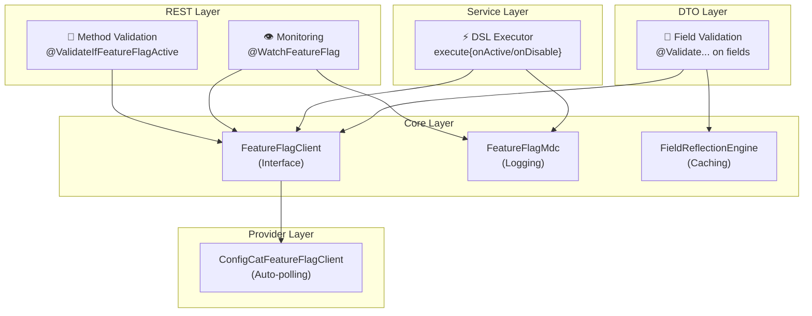

# 🚦 Feature Gate Middleware

[](https://github.com/soraiayugulis/feature-gate-middleware/releases)
[](https://kotlinlang.org)
[](https://spring.io)

## ✨ What is it?

Feature Gate Middleware brings feature flag capabilities to your Spring Boot applications through four integrated mechanisms:

1. **🎯 Method-Level Validation** - Validate incoming requests based on feature flags
2. **⚡ DSL Executor** - Functional API for conditional code execution  
3. **📝 Field Validation** - Conditionally validate DTO fields
4. **👁️ Monitoring** - AOP-based method interception with structured logging

Works with ConfigCat out-of-the-box, but provider-agnostic.

---

## 🚀 Quick Start

### Installation

```kotlin
dependencies {
    implementation("io.architecture:feature-flag-core:1.0.0")
}
```

### 1️⃣ Method-Level Validation

Validate REST endpoints based on feature flags:

```kotlin
@RestController
class UserController {
    
    // Block endpoint when flag is inactive
    @ValidateIfFeatureFlagActive(
        flagKey = "user-registration-enabled",
        contextIdField = "email"
    )
    @PostMapping("/users")
    fun register(@RequestBody dto: UserRegistrationDto): ResponseEntity<User> {
        return ResponseEntity.ok(userService.create(dto))
    }
    
    // Enable endpoint for percentage rollout (canary)
    @ValidateFeatureFlagByWave(
        flagKey = "new-api-v2",
        contextIdField = "email"
    )
    @PostMapping("/v2/users")
    fun registerV2(@RequestBody dto: UserRegistrationDto): ResponseEntity<User> {
        return ResponseEntity.ok(userService.createV2(dto))
    }
}
```

### 2️⃣ DSL Executor

Execute different code paths based on feature flags:

```kotlin
@Service
class PaymentService(
    private val executor: FeatureFlagExecutor
) {
    fun processPayment(payment: Payment, userId: String): PaymentResult {
        return executor.execute("new-payment-gateway", userId) {
            onActive { newGateway.process(payment) }
            onDisable { legacyGateway.process(payment) }
        }
    }
    
    // Optional handlers - returns null when undefined
    fun getBetaFeature(userId: String): BetaFeature? {
        return executor.execute("beta-v2", userId) {
            onActive { BetaFeature() }
        }
    }
}
```

### 3️⃣ Field-Level Validation

Validate DTO fields conditionally:

```kotlin
data class UserRegistrationDto(
    val email: String,
    
    // Require tax ID only when flag is active
    @field:ValidateIfFeatureFlagActive(
        flagKey = "require-verified-document",
        contextIdField = "email"
    )
    val taxId: String?,
    
    // Enable new fields for percentage of users
    @field:ValidateFeatureFlagByWave(
        flagKey = "new-profile-fields",
        contextIdField = "email"
    )
    val bio: String?
)
```

### 4️⃣ Method Monitoring

Monitor REST endpoint execution:

```kotlin
@RestController
class OrderController {
    
    @WatchFeatureFlag("new-checkout-flow")
    @PostMapping("/orders")
    fun createOrder(@RequestBody order: Order): ResponseEntity<Order> {
        // Execution logged with structured MDC context
        return ResponseEntity.ok(orderService.create(order))
    }
}
```

---

## 🏗️ Architecture



---

## 📦 Features

### 🎯 Method-Level Validation
- `@ValidateIfFeatureFlagActive` - Block endpoints when flag inactive
- `@ValidateFeatureFlagByWave` - Percentage rollout (canary)
- Jakarta Bean Validation integration
- Automatic 403 response for invalid requests

### ⚙️ DSL Executor  
- Functional Kotlin DSL with `onActive` / `onDisable`
- Generic type support (`<T>`)
- Optional handlers (return `null` if undefined)
- Exception transparency (no wrapping)
- Structured logging with MDC

### 📝 Field Validation
- Conditional validation based on feature flag state
- Reflection-based field extraction with caching
- Support for canary rollouts

### 👁️ Method Monitoring  
- `@WatchFeatureFlag` for REST endpoints
- Spring AOP aspect-oriented programming
- Structured logging with SLF4J MDC
- Automatic cleanup prevents thread contamination

### 📝 Structured Logging

All operations include MDC context:

```json
{
  "ff_key": "new-checkout-flow",
  "ff_context_id": "user-123",
  "ff_result": "true",
  "ff_mechanism": "FeatureFlagExecutor",
  "ff_method": "OrderController.createOrder"
}
```

---

## 🛠️ Tech Stack

| Component | Technology |
|-----------|-----------|
| **Language** | Kotlin 1.9.23 |
| **Framework** | Spring 6.1.6 |
| **Validation** | Jakarta Bean Validation 3.0 |
| **AOP** | AspectJ 1.9.21 |
| **Logging** | SLF4J + MDC |
| **Provider** | ConfigCat Java SDK 9.x |
| **Testing** | JUnit 5 + MockK |

---

## 📋 Configuration

```yaml
feature-flag:
  configcat:
    sdk-key: ${CONFIGCAT_SDK_KEY}
    polling-mode: auto-poll
    poll-interval-seconds: 60
```

---

## 🧩 Annotations Reference

| Annotation | Target | Parameters | Purpose |
|------------|--------|------------|---------|
| `@ValidateIfFeatureFlagActive` | Method/Field | `flagKey`, `contextIdField` | Block when flag inactive |
| `@ValidateFeatureFlagByWave` | Method/Field | `flagKey`, `contextIdField` | Percentage rollout |
| `@WatchFeatureFlag` | Method/Class | `flagKey` | Monitor execution |

---

## 🧪 Testing

```bash
./gradlew test
```

---
---


by @_sysout

