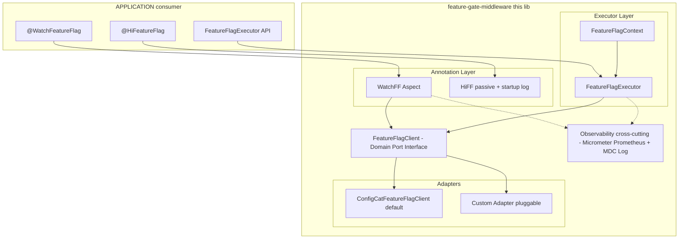

# Feature Gate Middleware — New Path Spec

> **Status**: REFINING — iterative collaboration in progress. No implementation until authorized.
> **Branch**: `refactor` (from initial commit `6942a09`)
> **Do not commit this document**


---

## 1. Redefined Scope

The project focuses on **three developer-facing touchpoints**:

| Point                 | Type       | Responsibility                                                  |
|-----------------------|------------|-----------------------------------------------------------------|
| `@WatchFeatureFlag`   | Annotation | Funnel metrics, behavior, and error collection                  |
| `@HiFeatureFlag`      | Annotation | Living documentation of feature flag flows at the entry point   |
| `FeatureFlagExecutor` | Component  | Functional on/off executor that removes `if` boilerplate        |

---

## 2. Project Value Proposition (beyond the obvious)

Beyond removing `if/else` boilerplate and abstracting the client, the project delivers:

1. **Provider portability**: Switching from ConfigCat to LaunchDarkly, Unleash, or any other provider is a single configuration change — zero impact on consumer application code.
2. **Observability out-of-the-box**: Every flag evaluation already emits structured telemetry (MDC/logs, metrics, traces) with no instrumentation required from the developer.
3. **Centralized governance**: A single audit point to know which flags are active, in which contexts, and how frequently — essential for safely decommissioning flags.
4. **Elevated Developer Experience (DX)**: `FeatureFlagExecutor` turns a conditional decision into a typed functional expression — more readable, more testable, no `if` to mock.
5. **Structural testability**: The `FeatureFlagClient` interface contract means consumer application unit tests never depend on the real SDK — they inject a trivial stub/fake.
6. **Living documentation with OpenAPI (roadmap)**: `@HiFeatureFlag` paves the way for Swagger/OpenAPI extensions that expose which endpoints are under a flag and with what semantics.
7. **Rollback safety**: The `onDisable` executor ensures the safe path (legacy code) is always explicitly declared — no rollback without an exit route.
8. **No network cold-start**: Local evaluation via polling cache (sub-millisecond) — flags never add perceptible latency to the request path.
9. **No framework coupling**: Annotations are agnostic to Spring MVC / Quarkus / Ktor — the adapter is the only framework-aware point.

---

## 3. Architectural Analysis

### 3.1 `@WatchFeatureFlag` — Metrics Collection

**Bottleneck Identification**: I/O-bound at the metrics sink (if synchronous). The flag evaluation itself is CPU-bound local (sub-ms). The risk lies in the mechanism used to publish collected data.

**Consistency Model**: Eventual consistency is the correct model here. Funnel metrics do not require transactional guarantees. Losing an isolated event is acceptable; blocking the request path is not.

**Scale Factor**: Under high concurrency, a synchronous sink destroys throughput. Micrometer solves this natively — its `MeterRegistry` implementations are non-blocking and designed for high-throughput environments.

#### Chosen Strategy: Micrometer → Prometheus

```
Request → @WatchFeatureFlag Aspect → MeterRegistry (Micrometer) → Prometheus Scrape Endpoint (/actuator/prometheus)
                                              ↑
                              Tags: ff.key, ff.status, ff.method, ff.error
```

**Why Micrometer over a raw Prometheus client?**

Micrometer is a **metrics facade** — it decouples the instrumentation code from the backend registry. This means the same `@WatchFeatureFlag` aspect code works with Prometheus today and with Datadog, CloudWatch, or InfluxDB tomorrow, with zero changes to this library. Using the raw Prometheus Java client would couple the lib to a single backend, breaking the provider-agnostic principle of this project.

**Enable/disable**: Metrics collection is opt-in. The aspect is a no-op unless the following property is set:
```yaml
feature-gate:
  watch:
    enabled: false  # default
```
When `false`, the `@WatchFeatureFlag` annotation is retained on the method (for `@HiFeatureFlag` cross-reference) but the aspect skips all instrumentation with a single boolean check — zero overhead.

**Dependency model**: `micrometer-core` is declared as `compileOnly` / `optional` in the library's Gradle module. The consuming application is responsible for providing the Micrometer dependency and configuring the backend registry. This lib contributes zero forced transitive dependencies. Auto-configuration via `@ConditionalOnClass(MeterRegistry::class)` ensures the metrics integration activates only when Micrometer is present on the classpath.

**What gets measured**:

| Metric Name                          | Type    | Tags                                         | Description                                      |
|--------------------------------------|---------|----------------------------------------------|--------------------------------------------------|
| `feature_flag.evaluation.total`      | Counter | `ff.key`, `ff.status`                        | Total evaluations per flag per result            |
| `feature_flag.evaluation.duration`   | Timer   | `ff.key`, `ff.status`                        | Method execution time under the flag             |
| `feature_flag.evaluation.errors`     | Counter | `ff.key`, `ff.error_type`                    | Total errors thrown inside monitored methods     |

> **⚠️ Tag cardinality**: `ff.method` (full HTTP path + verb) was removed from metric tags. In Prometheus, each unique tag value combination creates a new time series. High-cardinality tags (one per endpoint × flag × status) can exhaust memory and degrade scrape performance. `ff.method` is captured in the structured log — where high cardinality is free — not in the metric.

**Prometheus scrape example** (after Spring Boot Actuator exposure):
```
# HELP feature_flag_evaluation_total Total feature flag evaluations
# TYPE feature_flag_evaluation_total counter
feature_flag_evaluation_total{ff_key="new-discount",ff_status="ENABLED"} 1432.0
feature_flag_evaluation_total{ff_key="new-discount",ff_status="DISABLED"} 89.0

# HELP feature_flag_evaluation_duration_seconds Method execution time under feature flag
# TYPE feature_flag_evaluation_duration_seconds histogram
feature_flag_evaluation_duration_seconds_bucket{ff_key="new-discount",ff_status="ENABLED",le="0.05"} 1100.0
```

**Structured Log baseline** (emitted whenever the aspect executes, i.e., when `watch.enabled=true`):

When the aspect is active, a structured log line is emitted for every evaluation alongside the Micrometer metrics. Logs capture rich context that numeric metrics cannot (exception stack traces, request identifiers, user context). This is a complementary layer, not a fallback — both are active together.

```json
{
  "@timestamp": "2026-05-20T17:00:00.123Z",
  "level": "INFO",
  "logger": "io.featuregate.watch.WatchFeatureFlagAspect",
  "message": "Feature flag evaluation",
  "ff.key": "new-discount",
  "ff.status": "ENABLED",
  "ff.method": "POST /v1/orders",
  "ff.duration_ms": 12,
  "ff.error": false
}
```

#### Data Collected via `@WatchFeatureFlag`:

| Field            | Description                                       |
|------------------|---------------------------------------------------|
| `ff.key`         | Feature flag name                                 |
| `ff.status`      | `ENABLED` / `DISABLED`                            |
| `ff.method`      | Intercepted method/controller                     |
| `ff.duration_ms` | Method execution time (pre/post)                  |
| `ff.error`       | `true/false` if the method threw an exception     |
| `ff.error_type`  | Exception type (if any)                           |
| `ff.timestamp`   | Evaluation timestamp                              |

---

### 3.2 `@HiFeatureFlag` — Living Documentation

**Goal**: Primarily a documentation annotation. Signals to developers that an endpoint/method has an associated feature flag flow. It has a minimal, opt-in runtime behavior: when `local` logging mode is enabled, it logs all annotated endpoints at application startup — useful during development to get a map of all flag-gated flows.

**Proposed parameters**:
```kotlin
// Single flag (most common case)
@HiFeatureFlag(
    flagKeys = ["new-checkout-flow"],
    description = "Enables the new checkout flow with PIX priority"
)
fun processCheckout(@RequestBody dto: CheckoutDto): ResponseEntity<CheckoutResponse>

// Multiple flags on the same entry point (e.g., endpoint orchestrates two feature branches)
@HiFeatureFlag(
    flagKeys = ["new-checkout-flow", "pix-priority-routing"],
    description = "Checkout with PIX priority and new flow — both flags must be active"
)
fun processCheckout(@RequestBody dto: CheckoutDto): ResponseEntity<CheckoutResponse>
```

> `flagKeys` is an array — `@HiFeatureFlag` documents all flags that influence the annotated entry point. Each key appears as a separate entry in the startup inventory log and as a separate `x-feature-flag` extension item in the OpenAPI spec.

**Runtime behavior (local mode)**:

The annotation and its startup log behavior are both opt-in:
```yaml
feature-gate:
  hi:
    enabled: false         # default — annotation is inert at runtime
    log-on-startup: false  # default — startup inventory log
```
> **⚠️ Implementation note**: The scan must be triggered by `ApplicationListener<ContextRefreshedEvent>`, **not** `BeanPostProcessor`. `BeanPostProcessor` runs during the early bean creation phase, before controllers and other application beans are fully initialized — making reflection on their methods unreliable and potentially causing circular dependency issues. `ContextRefreshedEvent` fires after the entire application context is ready.

When `hi.enabled=true` and `hi.log-on-startup=true`, an `ApplicationListener<ContextRefreshedEvent>` scans all Spring beans at startup, collects methods annotated with `@HiFeatureFlag`, and emits a structured startup log. Each key in `flagKeys` is emitted as a separate entry:

```json
{
  "level": "INFO",
  "message": "[HiFeatureFlag] Feature-gated endpoints detected",
  "flags": [
    { "key": "new-checkout-flow",   "description": "Checkout with PIX priority and new flow", "method": "POST /v1/checkout" },
    { "key": "pix-priority-routing", "description": "Checkout with PIX priority and new flow", "method": "POST /v1/checkout" },
    { "key": "new-discount",         "description": "New discount calculation algorithm",      "method": "POST /v1/orders"  }
  ]
}
```

This gives the team a live inventory of all flag-gated surfaces every time the application starts — no dashboard lookup required.

**OpenAPI / Swagger Integration (Phase 8)**:

**Package**: `io.featuregate.spring.openapi.FeatureFlagOperationCustomizer`

**Dependency model**: `springdoc-openapi-starter-webmvc-ui` declared `compileOnly` in the library. The customizer bean is registered exclusively via `@ConditionalOnClass(OperationCustomizer::class)` — activates only when SpringDoc is on the consumer's classpath. Zero impact on non-Swagger consumers.

**How it works**:

1. **`FeatureFlagOperationCustomizer`** implements SpringDoc's `OperationCustomizer`. SpringDoc calls `customize(operation, handlerMethod)` for every endpoint during spec generation. The customizer reflects on `handlerMethod.method` to detect `@HiFeatureFlag`.

2. **What it injects** when `@HiFeatureFlag` is present:
   - Tag `"feature-flag"` added to the operation — groups all flag-gated endpoints in a dedicated Swagger UI section.
   - Vendor extension `x-feature-flags` (array — supports multiple keys per `flagKeys`):
     ```json
     "x-feature-flags": [
       { "key": "new-checkout-flow",    "description": "Checkout with PIX priority and new flow" },
       { "key": "pix-priority-routing", "description": "Checkout with PIX priority and new flow" }
     ]
     ```
   - Operation description suffix: `"⚑ This endpoint's behavior may vary based on active feature flags."` — appended to existing description, not replacing it.

3. **Swagger UI visual badge** — a SpringDoc `SwaggerUiConfigParameters` bean injects a custom JS plugin URL. The plugin reads `x-feature-flags` on each operation and renders a badge per key:
   ```
   [🚩 new-checkout-flow]  [🚩 pix-priority-routing]
   ```
   The JS file is served as a static resource from the library's `META-INF/resources/` — no external CDN, no consumer configuration required.

4. **`FeatureFlagOpenApiAutoConfiguration`** — separate `@AutoConfiguration` class (not mixed into `FeatureGateAutoConfiguration`) registered conditionally:
   ```kotlin
   @ConditionalOnClass(OperationCustomizer::class)
   @ConditionalOnProperty("feature-gate.hi.enabled", havingValue = "true")
   ```
   This keeps the OpenAPI wiring isolated from the core auto-configuration and avoids `NoClassDefFoundError` when SpringDoc is absent.

---

### 3.3 `FeatureFlagExecutor` — Functional Executor

**Bottleneck Identification**: CPU-bound local (flag evaluation against in-memory cache). No I/O in the critical path.

**Consistency Model**: Strongly consistent with the JVM local cache at the moment of the call.

**Scale Factor**: Linear. Each call is O(1) — hash lookup on the flags cache. No contention.

**Proposed API**:
```kotlin
// With targeting context (per-user evaluation)
featureFlagExecutor.execute(
    flag = "new-discount",
    context = FeatureFlagContext(
        identifier = customerId,           // required — unique user/session/device ID
        email      = customer.email,       // optional — used in email-based targeting rules
        country    = customer.country,     // optional — used in geo-based targeting rules
        custom     = mapOf("plan" to "premium", "role" to "admin")  // optional — any custom attribute
    ),
    onActive  = { baseValue * 0.85 },
    onDisable = { baseValue * 0.95 }
)

// Without context (global on/off flag — no per-user targeting)
featureFlagExecutor.execute(
    flag      = "maintenance-mode",
    onActive  = { throw ServiceUnavailableException() },
    onDisable = { proceedNormally() }
)
```

**`FeatureFlagContext` — field-by-field breakdown**:

This value class is a direct, typed mapping of the **ConfigCat User Object**, which is the standard targeting data structure in ConfigCat's SDK. The fields below mirror the ConfigCat `ConfigCatUser` model precisely:

| Field        | ConfigCat equivalent        | Required | Description                                                                                                  |
|--------------|-----------------------------|----------|--------------------------------------------------------------------------------------------------------------|
| `identifier` | `identifier` (required)     | Yes      | The unique ID of the user in your system — can be a database ID, UUID, email, or session ID. ConfigCat uses this as the seed for percentage-based rollouts (canary releases). |
| `email`      | `email` (optional)          | No       | User's email address. Enables rules like `"if email ends with @company.com → ENABLED"` on the ConfigCat dashboard. |
| `country`    | `country` (optional)        | No       | ISO country string. Enables geo-based targeting rules (e.g., `"if country = BR → ENABLED"`).               |
| `custom`     | `custom: Map<String, Any>`  | No       | Any application-specific attribute — plan tier, role, beta opt-in flag, account age, etc. These are fully defined by your team on the ConfigCat dashboard. |

**Design decisions**:
- `FeatureFlagContext` as a `data class` — Kotlin `value class` only supports a single backing property; since this class holds 4 fields it must be a `data class`. It still eliminates primitive obsession and provides a typed contract.
- `identifier` is the only required field; all others are optional with `null` defaults.
- `custom` accepts `Map<String, Any>` matching ConfigCat's SDK signature exactly — the adapter maps it 1:1.
- Generic return type `<T>` — type-safe, no casting.
- Exceptions inside lambdas propagate transparently (no swallowing).
- Context-free overload available for global on/off flags with no targeting.

---

## 4. Layered Architecture (Hexagonal)



---

## 5. Decisions Resolved

| # | Question                              | Decision                                                                                                    |
|---|---------------------------------------|-------------------------------------------------------------------------------------------------------------|
| 1 | Metrics sink for `@WatchFeatureFlag`  | **Micrometer → Prometheus** as primary sink. Opt-in via `feature-gate.watch.enabled=true`. MDC log always emitted as complementary layer. |
| 2 | `@HiFeatureFlag` runtime behavior     | **Opt-in** via `feature-gate.hi.enabled=true`. Startup log via `feature-gate.hi.log-on-startup=true`. OpenAPI integration is a planned feature. |
| 3 | `FeatureFlagContext` / targeting      | **Both modes supported**: full targeting (`identifier` + optional `email`, `country`, `custom`) and global on/off (no context). `identifier` is the only required field — aligned with ConfigCat User Object spec. |
| 4 | Consumer framework                    | **Framework-agnostic**. Core logic has no Spring dependency. Spring integration (AOP, auto-configuration) is an optional adapter module. |
| 5 | Provider adapter strategy             | **Hexagonal adapter pattern**. ConfigCat is the default implementation. Interface is public and documented for third-party adapters. |

---

## 6. Closed Points

### Module structure
Single module is chosen for simplicity and to avoid unnecessary complexity at this stage.

---

### `@WatchFeatureFlag` interception mechanism
Spring AOP for v1. Manual `FeatureFlagExecutor` call is the non-Spring path.

Framework-agnostic does not mean "supports every interception mechanism". It means the **core domain** (the interface, the context, the executor) has no framework dependency. The interception layer is inherently framework-coupled — that is its job.

- **Spring consumers**: use the `@WatchFeatureFlag` AOP aspect — zero boilerplate.
- **Non-Spring consumers**: call `featureFlagExecutor.execute(...)` directly, which already captures all the same metrics and logs internally. The annotation becomes optional documentation (`@HiFeatureFlag` only).

Adding a proxy-based interceptor or a bytecode-level agent for non-Spring would be a bazuka for an ant. The executor call is three lines and provides full observability.

> **Tradeoff accepted**: `@WatchFeatureFlag` only auto-intercepts in Spring contexts. Non-Spring devs wrap manually — this is explicitly documented.

---

### ConfigCat polling strategy
`autoPoll` with a configurable interval, defaulting to 60 seconds.

`autoPoll` is the standard production mode for ConfigCat: the SDK downloads the config JSON once at startup and refreshes it in the background at a fixed interval. Evaluation is always local (in-memory) — no network call per flag check.

- `lazyLoad`: fetches on first evaluation, then caches. Adds latency to the first request after cache expiry. Unpredictable for production.
- `manualPoll`: requires the application to call `refresh()` explicitly. Adds operational burden with no benefit for this use case.
- `autoPoll`: predictable, background refresh, zero request-path latency. Correct default.

Interval is configurable:
```yaml
feature-gate:
  configcat:
    sdk-key: "YOUR_SDK_KEY"
    poll-interval-seconds: 60  # default
```

> **Tradeoff accepted**: Config changes take up to `poll-interval-seconds` to propagate. Acceptable for feature flags — they are not designed for sub-second propagation.

---

### Error handling in `FeatureFlagClient`
Fail-safe to `onDisable`, no exception propagation.

A feature flag library that can crash the application on SDK failure defeats its own purpose. The `onDisable` branch is by definition the safe, known-good path (legacy behavior). Defaulting to it on any evaluation error means:

- The application keeps running normally.
- The error is logged with full context (flag key, exception type, stack trace).
- The Micrometer `feature_flag.evaluation.errors` counter increments — alertable in Prometheus.

Propagating the exception would require every `execute()` call site to add a try/catch, reintroducing the boilerplate this library exists to eliminate.

```kotlin
fun <T> execute(flag: String, context: FeatureFlagContext?, onActive: () -> T, onDisable: () -> T): T {
    require(flag.isNotBlank()) { "[FeatureGate] flag key must not be blank" }
    return try {
        if (client.isActive(flag, context)) onActive() else onDisable()
    } catch (e: Exception) {
        log.error("[FeatureGate] Evaluation failed for flag='$flag', falling back to onDisable", e)
        metrics.recordError(flag, e)
        try {
            onDisable()  // guard: onDisable itself may throw
        } catch (fallbackEx: Exception) {
            log.error("[FeatureGate] onDisable also failed for flag='$flag'", fallbackEx)
            throw fallbackEx  // propagate — both paths are broken, hiding it is wrong
        }
    }
}
```

> **Tradeoff accepted**: Silent fail-safe could mask misconfigured SDK keys or persistent outages. Mitigated by the error log + metric counter, which should be monitored and alerted.

> **⚠️ MDC — known limitation (unsupported)**: MDC is thread-local. The `@WatchFeatureFlag` aspect correctly sets and cleans MDC in synchronous, thread-per-request models (Spring MVC / Tomcat). For reactive stacks (WebFlux / Reactor) or virtual threads (Project Loom), MDC does not propagate across context switches without explicit consumer configuration. This library does not provide MDC bridging. Consumers in those environments are responsible for their own MDC propagation strategy (e.g., `MDCContext` from `kotlinx-coroutines-slf4j`, or a `ThreadLocal`-aware task executor). This is a documented limitation — not a planned feature.

---

## 7. Edge Cases & Failure Scenarios

> Generated by destructive QA analysis. Each item must have a defined behavior before implementation begins.

### EX-01 — Blank or empty `flag` key
**Scenario**: `featureFlagExecutor.execute(flag = "", ...)` or `@WatchFeatureFlag(flagKey = "")`.
**Risk**: SDK behavior is undefined for blank keys — may return `false`, throw, or match unintended flags.
**Defined behavior**: `require(flag.isNotBlank())` guard at `execute()` entry. For the annotation, a compile-time annotation processor or a startup validation bean checks all `@WatchFeatureFlag` and `@HiFeatureFlag` usages and throws `IllegalStateException` on blank keys before the first request is served.

---

### EX-02 — `onDisable` throws inside the fail-safe catch
**Scenario**: SDK evaluation fails → catch block calls `onDisable()` → `onDisable()` also throws.
**Risk**: Original exception is swallowed, stack trace points to the wrong cause.
**Defined behavior**: `onDisable()` inside the catch is wrapped in its own try/catch. If it throws, the fallback exception is logged separately and re-thrown. The original SDK exception is preserved as the suppressed cause. (See Q4 code snippet above.)

---

### EX-03 — AOP proxy bypass (`this.` internal call)
**Scenario**: A Spring bean calls an annotated method on itself via `this.myMethod()` instead of through the proxy.
**Risk**: Spring AOP is proxy-based — direct `this.` calls bypass the proxy entirely. `@WatchFeatureFlag` is silently ignored, no metrics, no logs, no error.
**Defined behavior**: Document this as a known Spring AOP limitation. Mitigation options: (a) self-injection via `@Autowired` proxy, (b) use `AopContext.currentProxy()`. Must be called out explicitly in the consumer documentation.

---

### EX-04 — ConfigCat first fetch fails at startup (network unavailable)
**Scenario**: Application starts, `autoPoll` fires the initial fetch, network is down. ConfigCat SDK cannot load the config JSON.
**Risk**: All flag evaluations return the SDK's built-in default — which is `false` (disabled) for boolean flags. This means all `@WatchFeatureFlag` methods run with `ff.status=DISABLED` silently until the first successful poll.
**Defined behavior**: The ConfigCat SDK handles this gracefully by design (offline mode with empty config). Our adapter must log a `WARN` at startup if the initial fetch fails, informing the operator that all flags are in fail-safe mode. The Prometheus `feature_flag.evaluation.errors` counter should NOT increment for this case — it is an expected startup condition, not a per-evaluation error.

---

### EX-05 — Missing or malformed `sdk-key`
**Scenario**: `feature-gate.configcat.sdk-key` is not set or is set to a placeholder value (e.g., `"YOUR_SDK_KEY"`).
**Risk**: The ConfigCat SDK will fail silently or return defaults for all flags. The application starts and runs, but no flags are ever active.
**Defined behavior**: On startup, the auto-configuration bean validates that `sdk-key` is non-blank and does not match known placeholder patterns. If invalid, throw `IllegalStateException` with a clear message: `"[FeatureGate] ConfigCat sdk-key is not configured. Set feature-gate.configcat.sdk-key."` — fast fail, no silent degradation.

---

### EX-06 — `@WatchFeatureFlag` key not declared in `@HiFeatureFlag.flagKeys`

**Semantic contract**:
- `@HiFeatureFlag` is the **source of truth** for the full set of feature flags that influence a given entry point. It documents the entire flow.
- `@WatchFeatureFlag` can instrument **more than one specific flag** from that set for metrics and observability.
- Therefore: **every key declared in `@WatchFeatureFlag` must be present in `@HiFeatureFlag.flagKeys`**. The inverse is not required — `@Hi` may document more flags than `@Watch` monitors.

**Correct usage**:
```kotlin
// @Hi declares the full flow (two flags); @Watch instruments one of them
@HiFeatureFlag(flagKeys = ["checkout-v2", "pix-routing"], description = "New checkout flow")
@WatchFeatureFlag(flagKey = "checkout-v2")
fun processCheckout(...): ResponseEntity<CheckoutResponse>
```

**Incorrect usage** (startup validator will `WARN`):
```kotlin
// @Watch monitors "checkout-v2" but @Hi does not list it — documentation gap
@HiFeatureFlag(flagKeys = ["pix-routing"], description = "New checkout flow")
@WatchFeatureFlag(flagKey = "checkout-v2")
fun processCheckout(...): ResponseEntity<CheckoutResponse>
```

**Risk**: If `@Watch.flagKey` is not present in `@Hi.flagKeys`, a monitored flag is invisible in the startup inventory, OpenAPI spec, and documentation. The team has metrics for a flag nobody documented.

**Defined behavior**: The startup validator (`ApplicationListener<ContextRefreshedEvent>`) checks that every `@WatchFeatureFlag.flagKey` is contained in `@HiFeatureFlag.flagKeys` on the same method. Violation emits a `WARN` with the method name and missing key. Not a hard failure — enforcement is informational to avoid blocking deployments over annotation hygiene.

---

### EX-07 — `@WatchFeatureFlag` on a `suspend` function (Kotlin coroutines)
**Scenario**: Consumer uses Kotlin coroutines. `@WatchFeatureFlag` is placed on a `suspend fun`.
**Risk**: Kotlin compiles `suspend fun` to a Java method with an appended `Continuation<T>` parameter and return type `Any?`. Spring AOP proxies operate at the Java bytecode level — `proceed()` returns `COROUTINE_SUSPENDED` immediately (before the coroutine resumes), causing two concrete failures:
1. Timer stops prematurely — duration measurement is wrong.
2. Return value replacement crashes — injecting a value where `Continuation` machinery expects a coroutine handle causes a runtime error.

**Defined behavior**: `@WatchFeatureFlag` is explicitly unsupported on `suspend fun`. The AOP aspect must guard against this at startup and emit a clear `IllegalStateException` if such usage is detected.

Coroutine consumers use `featureFlagExecutor.executeSuspend(flag, context?, onActive: suspend () -> T, onDisable: suspend () -> T)` — a dedicated `suspend` overload on `FeatureFlagExecutor` that provides **identical observability** (same Micrometer metrics, same MDC structured log, same fail-safe error handling) with zero AOP involvement.

---

### EX-08 — High-volume flag with many unique `identifier` values as custom tags
**Scenario**: A developer inadvertently adds `identifier` as a Micrometer tag.
**Risk**: One time series per unique user ID × flag × status = cardinality explosion, OOM in Prometheus.
**Defined behavior**: `identifier`, `email`, and any field from `FeatureFlagContext` are **never** used as Micrometer tags. Tags are restricted to the pre-defined set: `ff.key`, `ff.status`, `ff.error_type`. This is enforced in the aspect implementation, not left to the consumer.

---

## 8. DDIA Reliability & Scalability Assessment

### Reliability

| Failure Mode                        | Isolation                          | Recovery Behavior                                              |
|-------------------------------------|------------------------------------|----------------------------------------------------------------|
| ConfigCat network unreachable       | SDK in-memory cache serves stale   | All flags evaluate to `false` (fail-safe) — `WARN` at startup |
| ConfigCat SDK throws on evaluation  | `execute()` catch block            | Falls back to `onDisable`, logs + increments error counter     |
| `onDisable` lambda throws           | Nested catch in `execute()`        | Logs separately, re-throws — both paths broken, no hiding      |
| Missing `sdk-key`                   | Auto-configuration validation      | `IllegalStateException` at startup — fast fail                 |
| `@WatchFeatureFlag` aspect failure  | `@Around` try/catch                | Method still executes — observability lost, not the request    |

**Fault isolation principle**: every failure in this library is isolated to observability loss or fallback to known-safe behavior. No failure in the library should affect the business logic of the consumer application.

### Scalability

| Concern                             | Impact                             | Mitigation                                                     |
|-------------------------------------|------------------------------------|----------------------------------------------------------------|
| Flag evaluation latency             | ~0µs (in-memory hash lookup)       | None needed — non-issue                                        |
| `autoPoll` background thread        | 1 daemon thread per JVM instance   | Negligible. ConfigCat SDK uses a single scheduled executor.    |
| Micrometer `Timer.record()` under load | Low contention (`ConcurrentHashMap`) | p99 impact < 1µs at 10k RPS. Not a bottleneck.           |
| MDC `put/remove` under load         | Thread-local — zero contention     | Requires cleanup in `finally` to prevent context leak on thread pool reuse |
| ConfigCat config JSON size          | Grows with number of flags         | Typically < 50KB even with hundreds of flags. Negligible memory footprint. |

### Maintainability (Evolvability)

- **Adding a new provider**: Implement `FeatureFlagClient` interface, register as a Spring `@Bean` — zero changes to annotations or executor.
- **Changing metric tags**: Single change in the aspect — no consumer code affected.
- **Removing a feature flag**: `@HiFeatureFlag` + `@WatchFeatureFlag` removal is a compile-time signal. The startup inventory log will no longer list it — a natural audit trail.
- **Upgrading ConfigCat SDK**: Only the `ConfigCatFeatureFlagClient` adapter class is affected — hexagonal boundary holds.

---

*Iterative working document — updated each discussion cycle.*
